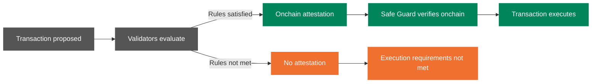

<Note>
Safenet is currently in Beta. The Validator set is permissioned and slashing is not yet active. See [Safenet Beta](/safenet/overview/beta) for current status.
</Note>

Safenet is a protocol for **onchain transaction security enforcement**.

It acts as a **last line of defense** against malicious or high-risk transactions by ensuring that transactions are **validated before execution**, rather than merely displaying warnings.

Safenet replaces centralized transaction-checking services with a **resilient, Validator-based network** that enforces security guarantees onchain. Existing security providers can participate in this network.

## How Safenet protects accounts

Most transaction security tools today only issue warnings and have no effect on transaction execution. Safenet introduces a different approach: its Validator process enforces transaction attestations directly at the protocol level.

When a transaction is proposed, Safenet Validators evaluate it against a defined set of security rules. If the transaction satisfies these rules, Validators produce a cryptographic attestation. The Safe Guard verifies this attestation onchain as part of the execution process. Transactions without a valid attestation cannot satisfy the protocol's execution requirements.

*How a transaction moves through Safenet.*

<Note>
Users remain in full self-custody at all times. If a transaction does not satisfy the protocol's requirements and you still want to proceed, that is possible upon explicit, additional owner approval after a time delay. Safenet does not override owner control.
</Note>

As a result, protection is enforced at the protocol level rather than relying on user behavior. A phishing site, a compromised wallet UI, or an opaque approval flow cannot circumvent these enforced attestations.

## What makes Safenet different

**Decentralized validation**
Security checks are performed by a network of Validators, not a single API or server. The network tolerates up to one-third of Validators acting dishonestly and still produces correct attestations. This property is known as Byzantine Fault Tolerance (BFT).

**Onchain enforcement**
Attestations are compact cryptographic signatures. Verification is gas-efficient and permissionless: any EVM-compatible chain can integrate without proprietary infrastructure. A transaction without a valid attestation does not satisfy the protocol's execution requirements, regardless of who signed it.

**A path to sustainable security incentives**
Safenet aims to create a market for transaction security: Transaction Checkers compete to provide real-time risk signals, and Validators attest to market outcomes. It is envisioned that this creates a sustainable path toward fee-based security mechanisms, which makes staking economically meaningful. These mechanisms are planned for after Beta.

**Open to all chains and wallets**
Any Safe on any supported EVM chain can use Safenet. No proprietary infrastructure required.

## Who is Safenet for?

**Safe users**
Safenet protects your account from malicious transactions, even if your wallet UI is compromised. See the [FAQ](/safenet/resources/faq) to learn more and explore recent network activity.

**Stakers and Delegators**
Delegate SAFE tokens to Validators and earn rewards for securing the network. See [Staking](/safenet/staking/validator-staking).

**Validators, wallet operators, and security firms**
If you are interested in running a Validator, integrating Safenet into your wallet, or contributing transaction security logic, reach out.

TODO: Add reach-out form link once available.

## Safenet Beta

Safenet is currently live in Beta, focusing on core consensus, threshold signing, and SAFE token staking with a permissioned Validator set.

See [Safenet Beta](/safenet/overview/beta) for what is live today, and the [Roadmap](/safenet/overview/roadmap) for what comes next.
