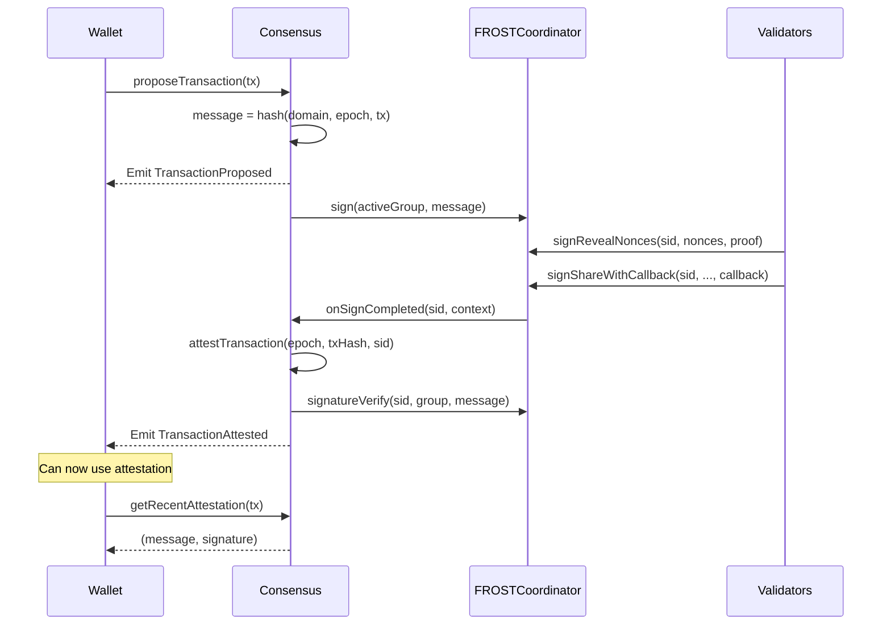

### Purpose

| Function | Description |
|----------|-------------|
| **Epoch Management** | Track active, staged, and previous validator groups |
| **Transaction Proposals** | Submit transactions for validator approval |
| **Attestation Recording** | Store FROST signatures that prove validator consensus |
| **Rollover Coordination** | Manage transitions between validator sets |

### Key Characteristics

- Optimized for use with a block explorer (so no reliance on a single client, and additional Safenet clients should be thin and easy to implement).
- Attestation over Safe transactions directly; so you can copy-paste your Safe tx hash to get an indication on whether or not a transaction is verified
- Cryptographic attestations, that can be cost-effectively verified on any EVM-chain
- Onchain and publicly auditable

---

## ELI5: What is Consensus?

Think of Safenet like a security checkpoint at an airport:

1. **Validators are security guards** - they check if transactions are safe
2. **Epochs are shift changes** - different groups of guards work at different times
3. **Attestations are approval stamps** - proof that guards checked and approved something

The Consensus contract:
- Knows which guards are on duty right now (active epoch)
- Manages shift changes smoothly (epoch rollover)
- Records all the approval stamps (attestations)
- Keeps recent stamps accessible for verification

When you want to execute a transaction:
1. You propose it to the guards
2. Guards check if it's safe
3. If approved, they sign it together (FROST signature)
4. The signature is recorded as an attestation
5. You can now use this attestation to prove approval

---

### Transaction Attestation



---

## Integration Guide

This section provides examples for integrating with the Consensus contract, primarily for **off-chain clients and applications** that need to propose transactions, monitor their attestation status, or track epoch changes.

### Proposing a Transaction

```solidity
// 1. Create Safe transaction
SafeTransaction.T memory tx = SafeTransaction.T({
    chainId: block.chainid,
    safe: safeAddress,
    to: targetContract,
    value: 0,
    data: abi.encodeCall(Target.someFunction, (args)),
    operation: SafeTransaction.Operation.CALL,
    safeTxGas: 0,
    baseGas: 0,
    gasPrice: 0,
    gasToken: address(0),
    refundReceiver: address(0),
    nonce: currentNonce
});

// 2. Propose to consensus
bytes32 message = consensus.proposeTransaction(tx);

// 3. Wait for TransactionAttested event

// 4. Retrieve attestation
(bytes32 msg, FROST.Signature memory sig) = consensus.getRecentAttestation(tx);
```

### Checking Attestation Status

```solidity
// Check if transaction is attested in current or previous epoch
try consensus.getRecentAttestationByHash(txHash) returns (bytes32 msg, FROST.Signature memory sig) {
    // Attested - sig.r and sig.z are valid
    if (sig.r.x != 0 || sig.r.y != 0) {
        // Has valid signature
    }
} catch {
    // Not attested in recent epochs
}
```

### Monitoring Epoch Changes

```solidity
// Listen for events
event EpochProposed(uint64 indexed activeEpoch, uint64 indexed proposedEpoch, ...);
event EpochStaged(uint64 indexed activeEpoch, uint64 indexed proposedEpoch, ...);
event EpochRolledOver(uint64 indexed newActiveEpoch);

// Query current state
(uint64 epoch, FROSTGroupId.T group) = consensus.getActiveEpoch();
Consensus.Epochs memory epochs = consensus.getCurrentEpochs();
```

---
