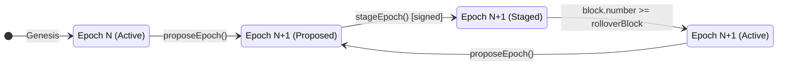
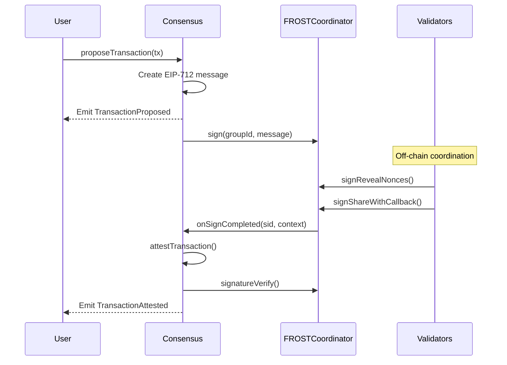
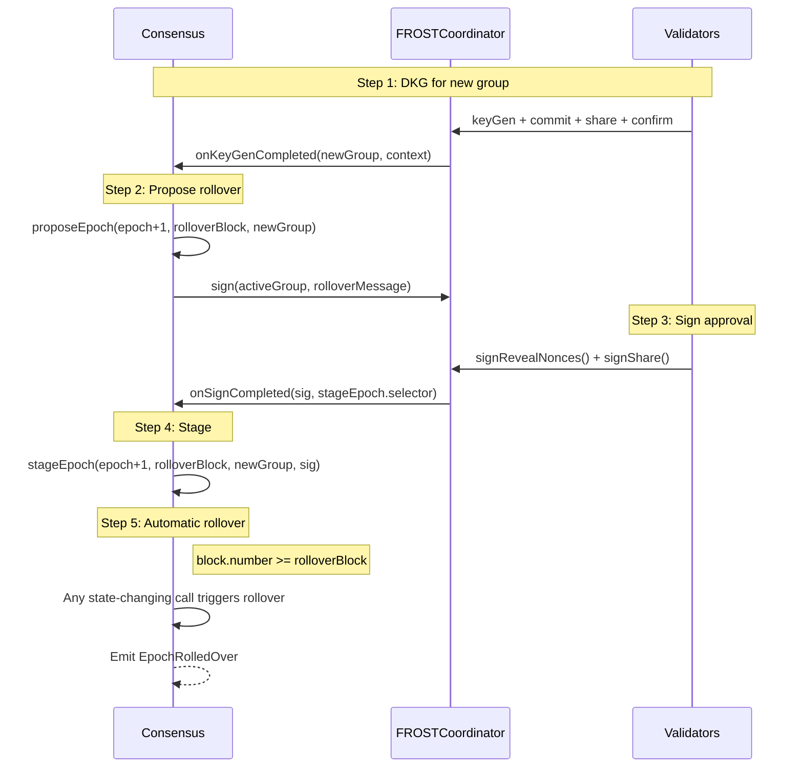
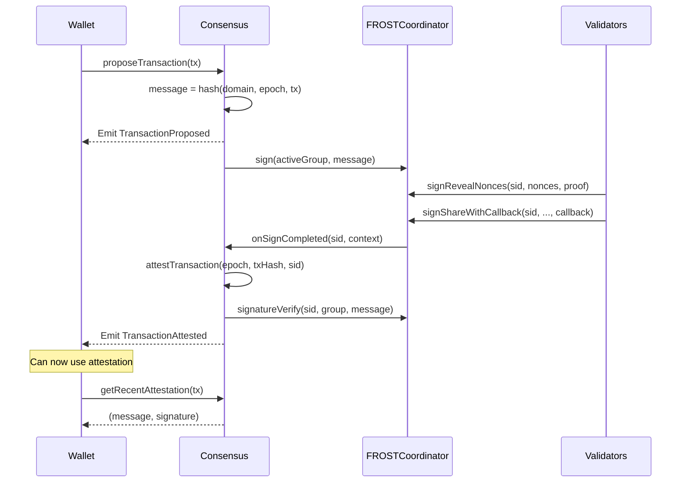

## Overview

The `Consensus` contract manages the **protocol state machine** for Safenet. It tracks validator set epochs, coordinates transaction proposals, and records attestations from the validator network.

### Purpose

| Function | Description |
|----------|-------------|
| **Epoch Management** | Track active, staged, and previous validator groups |
| **Transaction Proposals** | Submit transactions for validator approval |
| **Attestation Recording** | Store FROST signatures that prove validator consensus |
| **Rollover Coordination** | Manage transitions between validator sets |

### Key Characteristics

- **Lazy Rollover**: Epoch transitions happen automatically when triggered
- **EIP-712 Messages**: All signed messages follow EIP-712 structured data standard
- **Callback Integration**: Receives completion notifications from FROSTCoordinator
- **History Preservation**: Maintains previous epoch for recent attestation lookups

---

## ELI5: What is Consensus?

Think of Safenet like a security checkpoint at an airport:

1. **Validators are security guards** - they check if transactions are safe
2. **Epochs are shift changes** - different groups of guards work at different times
3. **Attestations are approval stamps** - proof that guards checked and approved something

The Consensus contract:
- Knows which guards are on duty right now (active epoch)
- Manages shift changes smoothly (epoch rollover)
- Records all the approval stamps (attestations)
- Keeps recent stamps accessible for verification

When you want to execute a transaction:
1. You propose it to the guards
2. Guards check if it's safe
3. If approved, they sign it together (FROST signature)
4. The signature is recorded as an attestation
5. You can now use this attestation to prove approval

---

## Epoch Lifecycle

Epochs represent periods governed by specific validator sets. Each epoch has an associated FROST group.



### Epoch States

| Field | Type | Description |
|-------|------|-------------|
| `previous` | `uint64` | Last active epoch (for history) |
| `active` | `uint64` | Currently active epoch |
| `staged` | `uint64` | Next epoch (0 if none staged) |
| `rolloverBlock` | `uint64` | Block when staged becomes active |

### Rollover Process

1. **Propose**: Create a new epoch proposal (optional step)
2. **Stage**: Active validators sign approval → epoch is staged
3. **Rollover**: Automatic when `block.number >= rolloverBlock`

**Lazy Execution**: Rollover happens automatically on the next state-changing call after `rolloverBlock` is reached.

---

## Transaction Attestation Flow



---

## Data Structures

### Structs

#### `Epochs`
Tracks validator set epoch state.

```solidity
struct Epochs {
    uint64 previous;      // Previously active epoch
    uint64 active;        // Currently active epoch
    uint64 staged;        // Next epoch (0 if none)
    uint64 rolloverBlock; // When staged becomes active
}
```

**Invariants**:
- `staged == 0` implies no rollover pending
- `rolloverBlock > 0` only when `staged > 0`
- `previous < active` (always)
- `active < staged` (when staged)

---

## Storage Variables

| Variable | Type | Visibility | Description |
|----------|------|------------|-------------|
| `_COORDINATOR` | `FROSTCoordinator` | immutable | FROST coordinator contract |
| `$epochs` | `Epochs` | private | Current epoch state |
| `$groups` | `mapping(uint64 => FROSTGroupId.T)` | private | Epoch to group mapping |
| `$attestations` | `mapping(bytes32 => FROSTSignatureId.T)` | private | Message to signature mapping |

---

## External Functions

### Epoch Management

#### `proposeEpoch(uint64 proposedEpoch, uint64 rolloverBlock, FROSTGroupId.T group)`

Propose a new epoch for validator approval.

**Parameters**:
- `proposedEpoch`: The new epoch number
- `rolloverBlock`: Block number when rollover should occur
- `group`: FROST group ID for the new epoch

**Requirements**:
- `proposedEpoch > active epoch`
- `rolloverBlock > current block`
- No epoch currently staged

**Flow**:
1. Validates rollover parameters
2. Emits `EpochProposed`
3. Requests signature from active group via `FROSTCoordinator.sign()`

**Note**: This step is optional. You can call `stageEpoch` directly if you already have a valid signature.

---

#### `stageEpoch(uint64 proposedEpoch, uint64 rolloverBlock, FROSTGroupId.T group, FROSTSignatureId.T signature)`

Stage an epoch after it's been signed by the active group.

**Parameters**:
- Same as `proposeEpoch`, plus:
- `signature`: ID of the FROST signature from active group

**Requirements**:
- Same as `proposeEpoch`
- Valid signature from active group

**Effect**:
- Sets `staged = proposedEpoch`
- Sets `rolloverBlock`
- Maps epoch to group
- Emits `EpochStaged`

---

### Transaction Operations

#### `proposeTransaction(MetaTransaction.T transaction) → bytes32`

Submit a transaction for validator approval.

**Parameters**:
- `transaction`: The meta-transaction to validate

**Returns**: EIP-712 message hash

**Flow**:
1. Processes any pending rollover
2. Creates EIP-712 structured message
3. Emits `TransactionProposed`
4. Initiates signing via `FROSTCoordinator.sign()`

---

#### `attestTransaction(uint64 epoch, bytes32 transactionHash, FROSTSignatureId.T signature)`

Record an attestation for a transaction.

**Parameters**:
- `epoch`: Epoch when transaction was proposed
- `transactionHash`: Hash of the meta-transaction
- `signature`: FROST signature ID

**Effect**:
- Verifies signature matches group and message
- Stores attestation mapping
- Emits `TransactionAttested`

**Note**: No time limit on attestation. Even old signatures can be recorded.

---

### Callback Functions (Coordinator Only)

#### `onKeyGenCompleted(FROSTGroupId.T group, bytes context)`

Called by FROSTCoordinator when DKG completes.

**Behavior**: Automatically proposes epoch rollover with the new group.

---

#### `onSignCompleted(FROSTSignatureId.T signature, bytes context)`

Called by FROSTCoordinator when signing completes.

**Behavior**: Routes to `stageEpoch` or `attestTransaction` based on context selector.

---

### View Functions

#### `domainSeparator() → bytes32`

Get the EIP-712 domain separator.

---

#### `getAttestation(uint64 epoch, MetaTransaction.T transaction) → (bytes32, FROST.Signature)`

Get attestation for a specific epoch and transaction.

**Returns**:
- `message`: EIP-712 message hash
- `signature`: The FROST signature

---

#### `getAttestationByMessage(bytes32 message) → FROST.Signature`

Get attestation by message hash directly.

---

#### `getRecentAttestation(MetaTransaction.T transaction) → (bytes32, FROST.Signature)`

Get attestation from active or previous epoch.

**Use Case**: Convenience for clients who recently proposed a transaction.

---

#### `getRecentAttestationByHash(bytes32 transactionHash) → (bytes32, FROST.Signature)`

Same as above, by transaction hash.

---

#### `getActiveEpoch() → (uint64 epoch, FROSTGroupId.T group)`

Get current active epoch and its group.

---

#### `getCurrentEpochs() → Epochs`

Get full epoch state (previous, active, staged).

---

#### `getEpochGroup(uint64 epoch) → (FROSTGroupId.T, Secp256k1.Point)`

Get group ID and public key for any epoch.

---

## Process Flows

### Complete Epoch Rollover



### Transaction Attestation



---

## Security Considerations

### Access Control

| Function | Access | Rationale |
|----------|--------|-----------|
| `proposeEpoch`, `stageEpoch` | Public | Anyone can initiate, but requires valid signature |
| `proposeTransaction` | Public | Anyone can propose |
| `attestTransaction` | Public | Requires valid FROST signature |
| `onKeyGenCompleted`, `onSignCompleted` | Coordinator only | Callbacks from trusted contract |

### Invariants

1. **Epoch Ordering**: `previous < active < staged` (when all set)
2. **Signature Validity**: Attestations always verified against group
3. **Rollover Consistency**: Can't stage while one is pending

### Attack Vectors

| Attack | Mitigation |
|--------|------------|
| **Unauthorized epoch change** | Requires signature from active group |
| **Transaction forgery** | FROST signature verification |
| **Replay attacks** | Epoch-scoped messages, nonces in transactions |
| **Front-running rollover** | Deterministic rollover at block number |

### Edge Cases

1. **Attestation timing**: No expiry on attestations - old signatures remain valid
2. **Missed rollover**: Rollover is lazy; happens on next state-changing call
3. **Previous epoch queries**: Only active and previous epochs accessible via `getRecentAttestation`

---

## Integration Guide

### Proposing a Transaction

```solidity
// 1. Create meta-transaction
MetaTransaction.T memory tx = MetaTransaction.T({
    chainId: block.chainid,
    account: safeAddress,
    to: targetContract,
    value: 0,
    operation: MetaTransaction.Operation.CALL,
    data: abi.encodeCall(Target.someFunction, (args)),
    nonce: currentNonce
});

// 2. Propose to consensus
bytes32 message = consensus.proposeTransaction(tx);

// 3. Wait for TransactionAttested event

// 4. Retrieve attestation
(bytes32 msg, FROST.Signature memory sig) = consensus.getRecentAttestation(tx);
```

### Checking Attestation Status

```solidity
// Check if transaction is attested in current or previous epoch
try consensus.getRecentAttestationByHash(txHash) returns (bytes32 msg, FROST.Signature memory sig) {
    // Attested - sig.r and sig.z are valid
    if (sig.r.x != 0 || sig.r.y != 0) {
        // Has valid signature
    }
} catch {
    // Not attested in recent epochs
}
```

### Monitoring Epoch Changes

```solidity
// Listen for events
event EpochProposed(uint64 indexed activeEpoch, uint64 indexed proposedEpoch, ...);
event EpochStaged(uint64 indexed activeEpoch, uint64 indexed proposedEpoch, ...);
event EpochRolledOver(uint64 indexed newActiveEpoch);

// Query current state
(uint64 epoch, FROSTGroupId.T group) = consensus.getActiveEpoch();
Consensus.Epochs memory epochs = consensus.getCurrentEpochs();
```

---
