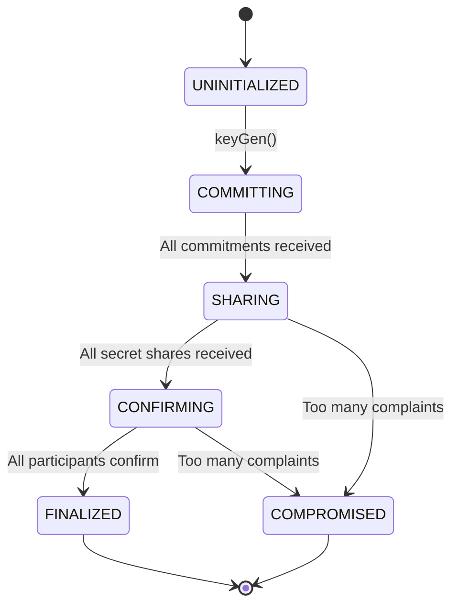
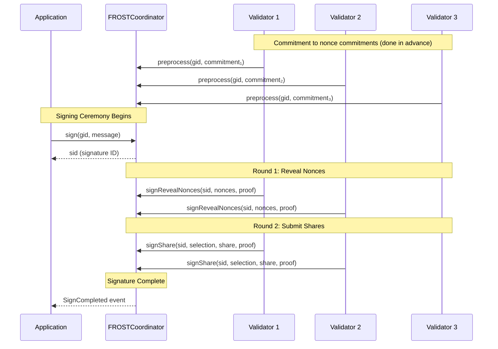
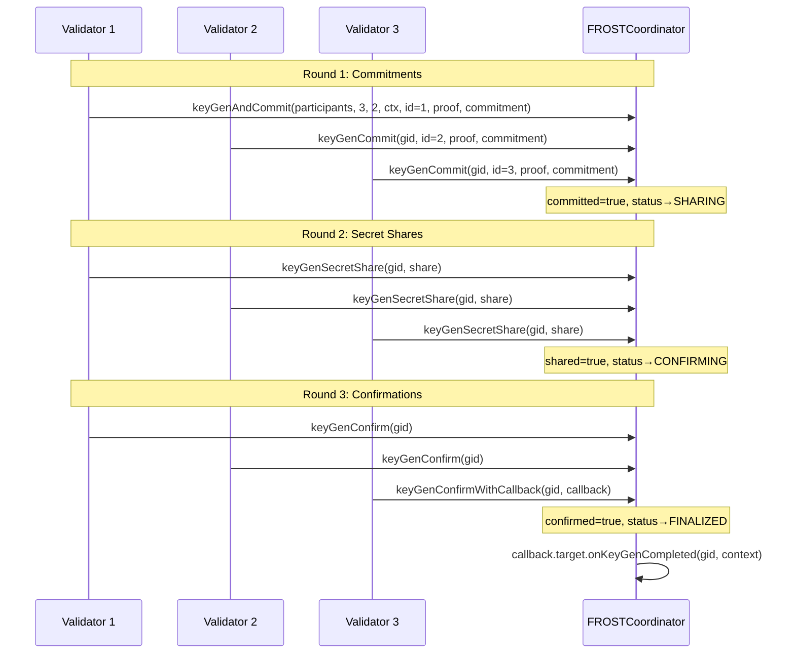

### Purpose

| Function | Description |
|----------|-------------|
| **Key Generation** | Coordinate DKG ceremonies to create threshold signing groups |
| **Nonce Management** | Track precommitted nonces for secure signing |
| **Signature Aggregation** | Collect and aggregate signature shares |
| **Callback Integration** | Notify other contracts when ceremonies complete |

### Key Characteristics

- **Stateless Ceremonies**: Each ceremony is identified by deterministic IDs
- **[RFC-9591](https://datatracker.ietf.org/doc/html/rfc9591) Compliant**: Implements FROST(secp256k1, SHA-256) ciphersuite

---

## ELI5: What is FROST?

Imagine a treasure chest that needs multiple keys to open:

**Traditional Multi-sig**: 
- 3 people each have their own key
- Need 2-of-3 keys to open
- Everyone knows exactly who signed

**FROST Threshold Signatures**:
- 3 people collectively create ONE "master key"
- Each person holds a PIECE of this key (not a complete key!)
- Nobody can reconstruct the full private key

**Why is this better?**
1. **Efficiency**: One signature instead of multiple
2. **Compatibility**: Works with existing systems expecting single signatures
3. **Security**: No single point of failure - the full key never exists in one place

---

## FROST Protocol Deep Dive

### Mathematical Foundations

Before diving into the protocol, let's establish the key mathematical concepts:

#### Notation Reference

| Symbol | Meaning |
|--------|---------|
| $G$ | Generator point of secp256k1 curve |
| $N$ | Order of the curve (~2²⁵⁶) |
| $n$ | Number of participants |
| $t$ | Threshold (minimum signers needed) |
| $i$ | Participant identifier (1 to n) |
| $sk_i$ | Participant $i$'s secret signing share |
| $PK$ | Group public key |
| $pk_i$ | Participant $i$'s public key share |

#### Lagrange interpolation

FROST uses **Lagrange interpolation** to split a secret into pieces:

1. Choose a secret $s$ (this will be the group's private key)
2. Create a polynomial of degree $t-1$: $f(x) = s + a_1x + a_2x² + ... + a_{t-1}x^{t-1}$
3. Each participant $i$ gets share $sk_i = f(i)$
4. Any $t$ shares can reconstruct $s$, but $t-1$ shares reveal nothing

**Key insight**: In FROST, nobody knows $s$! Each participant contributes to the polynomial, and the group secret emerges from combining everyone's contributions.

---

### Distributed Key Generation (DKG)

DKG allows a group of participants to jointly generate a shared public key and individual private key shares, without any trusted dealer.

---

### Threshold Signing

Once DKG is complete, any $t$ participants can create a valid signature without ever reconstructing the group private key.

---

#### Security Properties

1. No single party knows the full private key $s$
2. Each nonce is used exactly once (enforced by contract)
3. Share verification prevents malicious shares
4. Binding factors prevent nonce substitution attacks

---

## Process Flows

### Complete DKG Flow

---

## Security Considerations

### Nonce Security

**CRITICAL**: Nonce reuse is catastrophic!

If the same nonce $(d, e)$ is used twice with different messages:

**First signature**: $z_1 = d + \rho_1 e + \lambda_1 s_1 c_1$

**Second signature** (same nonces, different message): $z_2 = d + \rho_2 e + \lambda_2 s_2 c_2$

If $\rho_1 = \rho_2$ and $\lambda_1 = \lambda_2$:
$$z_1 - z_2 = s_1(c_1 - c_2)$$
$$s_1 = \frac{z_1 - z_2}{c_1 - c_2}$$

**Secret key share leaked!**

**Mitigations**:
1. **Merkle proofs**: Contract enforces precommitted nonces
2. **Two-nonce scheme**: Binding factor $\rho$ varies per ceremony

### DKG Security

| Attack | Description | Mitigation |
|--------|-------------|------------|
| **Rogue key attack** | Choosing commitment based on others | Proof of knowledge in Round 1 |
| **Biased key** | Influencing final group key | Commit-then-reveal protocol |
| **Invalid shares** | Sending wrong polynomial evaluations | Complaint mechanism with verification |
| **ECDH key extraction** | Recovering encryption keys | Ephemeral keys per DKG |

### Threshold Assumptions

- Security requires at minimum $t$ honest participants
- If $t$ or more participants collude, they can:
  - Sign any message
  - Recover the full group private key
- Choose $t$ based on your threat model:
  - Higher $t$ = more security, less availability
  - Lower $t$ = less security, more availability
- If $< t$ are honest, liveness fails (can't sign)

---

## Reference

- [RFC-9591: FROST Protocol](https://datatracker.ietf.org/doc/html/rfc9591)
