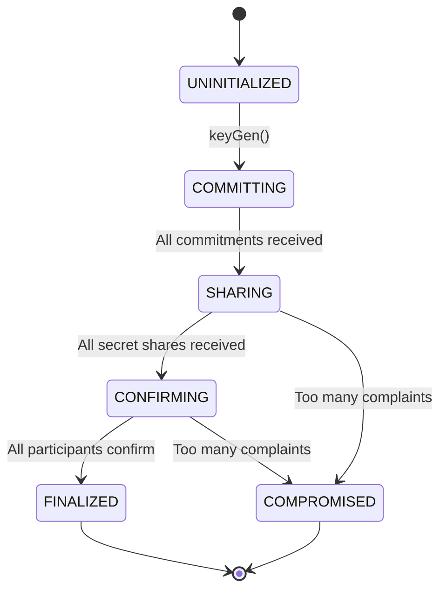
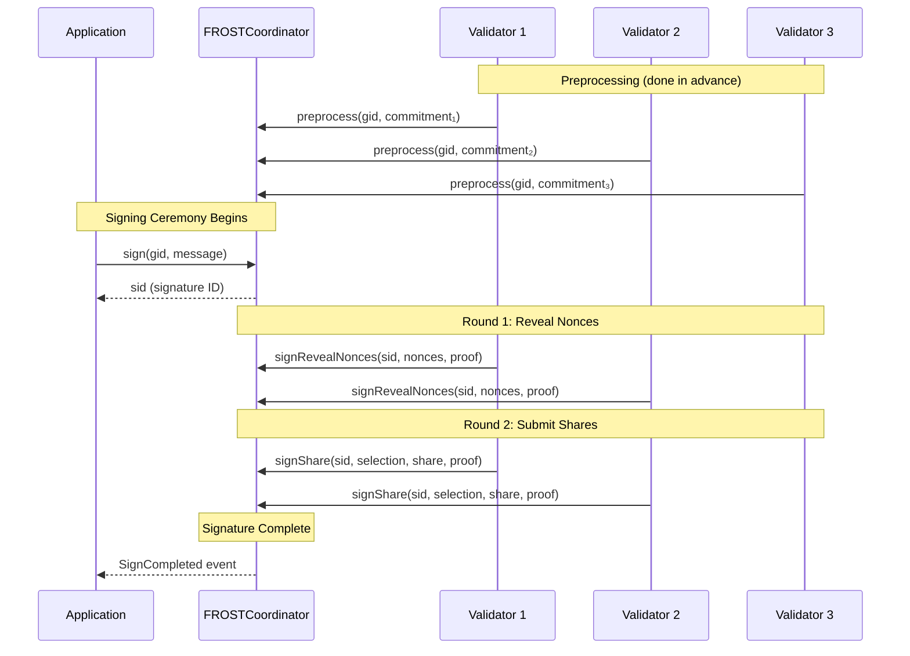
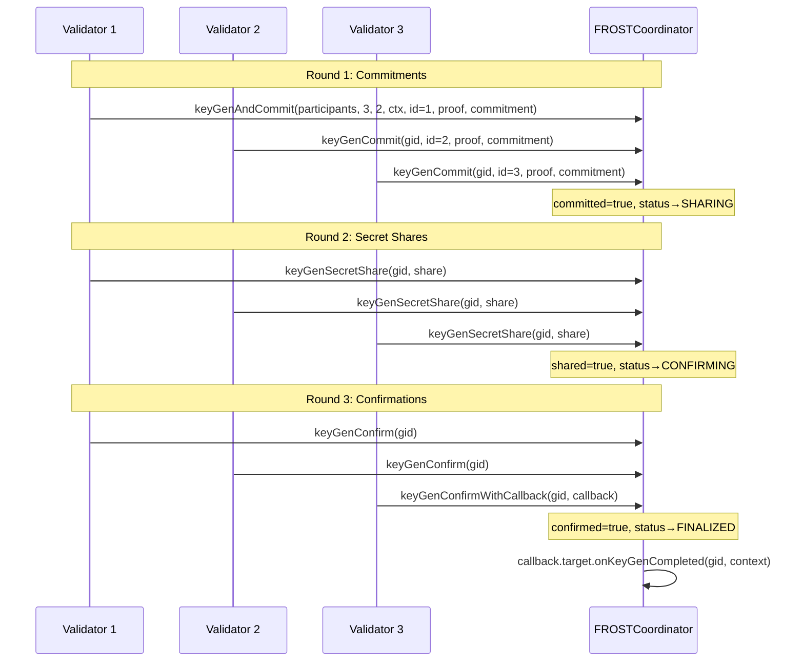
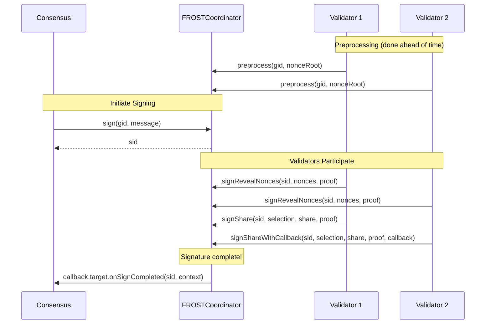

## Overview

The `FROSTCoordinator` contract orchestrates **distributed key generation (DKG)** and **threshold signing ceremonies** for FROST groups. It is the cryptographic heart of Safenet, enabling validators to collectively generate and use shared signing keys without any single party knowing the complete private key.

### Purpose

| Function | Description |
|----------|-------------|
| **Key Generation** | Coordinate DKG ceremonies to create threshold signing groups |
| **Nonce Management** | Track precommitted nonces for secure signing |
| **Signature Aggregation** | Collect and aggregate signature shares |
| **Callback Integration** | Notify other contracts when ceremonies complete |

### Key Characteristics

- **Stateless Ceremonies**: Each ceremony is identified by deterministic IDs
- **onchain Verification**: All cryptographic proofs verified onchain
- **Merkle-based Participation**: Efficient membership verification
- **RFC-9591 Compliant**: Implements FROST(secp256k1, SHA-256) ciphersuite

---

## ELI5: What is FROST and Why Do We Need It?

Imagine a treasure chest that needs multiple keys to open:

**Traditional Multi-sig**: 
- 3 people each have their own key
- Need 2-of-3 keys to open
- Everyone knows exactly who signed

**FROST Threshold Signatures**:
- 3 people collectively create ONE "master key"
- Each person holds a PIECE of this key (not a complete key!)
- Any 2 can combine their pieces to sign
- The signature looks like it came from one person
- Nobody can reconstruct the full private key

**Why is this better?**
1. **Privacy**: Can't tell which 2 of 3 signed
2. **Efficiency**: One signature instead of multiple
3. **Compatibility**: Works with existing systems expecting single signatures
4. **Security**: No single point of failure - the full key never exists in one place

---

## FROST Protocol Deep Dive

### Mathematical Foundations

Before diving into the protocol, let's establish the key mathematical concepts:

#### Notation Reference

| Symbol | Meaning |
|--------|---------|
| $G$ | Generator point of secp256k1 curve |
| $N$ | Order of the curve (~2²⁵⁶) |
| $n$ | Number of participants |
| $t$ | Threshold (minimum signers needed) |
| $i$ | Participant identifier (1 to n) |
| $sk_i$ | Participant $i$'s secret signing share |
| $PK$ | Group public key |
| $pk_i$ | Participant $i$'s public key share |

#### Shamir's Secret Sharing (The Core Idea)

FROST uses **Shamir's Secret Sharing** to split a secret into pieces:

1. Choose a secret $s$ (this will be the group's private key)
2. Create a polynomial of degree $t-1$: $f(x) = s + a_1x + a_2x² + ... + a_{t-1}x^{t-1}$
3. Each participant $i$ gets share $sk_i = f(i)$
4. Any $t$ shares can reconstruct $s$, but $t-1$ shares reveal nothing

**Key insight**: In FROST, nobody knows $s$! Each participant contributes to the polynomial, and the group secret emerges from combining everyone's contributions.

---

### Distributed Key Generation (DKG)

DKG allows a group of participants to jointly generate a shared public key and individual private key shares, without any trusted dealer.

---

### Threshold Signing

Once DKG is complete, any $t$ participants can create a valid signature without ever reconstructing the group private key.

---

#### Critical Security Properties

1. ✅ No single party knows the full private key $s$
2. ✅ Each nonce is used exactly once (enforced by contract)
3. ✅ Share verification prevents malicious shares
4. ✅ Binding factors prevent nonce substitution attacks

---

## External Functions

### Key Generation

#### `keyGen(bytes32 participants, uint16 count, uint16 threshold, bytes32 context) → FROSTGroupId.T`

Initialize a new DKG ceremony.

**Parameters**:
- `participants`: Merkle root of participant list
- `count`: Total number of participants (n)
- `threshold`: Signing threshold (t)
- `context`: Application-specific context data

**Requirements**:
- `count >= threshold`
- `threshold > 1`

**Returns**: Deterministic group ID

---

#### `keyGenCommit(gid, identifier, poap, commitment) → bool`

Submit commitment for Round 1.

**Parameters**:
- `gid`: Group ID
- `identifier`: FROST identifier (1 to n)
- `poap`: Merkle proof of participation
- `commitment`: Public commitments and proof

**Requirements**:
- Group status is `COMMITTING`
- `commitment.c.length == threshold`
- Valid Merkle proof

**Returns**: `true` if all commitments received (phase advances)

---

#### `keyGenAndCommit(...) → (FROSTGroupId.T, bool)`

Combined `keyGen` + `keyGenCommit` for convenience.

---

#### `keyGenSecretShare(gid, share) → bool`

Submit encrypted shares for Round 2.

**Parameters**:
- `gid`: Group ID
- `share`: Public key share and encrypted evaluations

**Requirements**:
- Group status is `SHARING`
- `share.f.length == count - 1`
- Caller already committed in Round 1

**Returns**: `true` if all shares received (phase advances)

---

#### `keyGenConfirm(gid) → bool`

Confirm successful DKG participation.

**Requirements**:
- Group status is `CONFIRMING`
- Caller participated in previous rounds
- No unresolved complaints by this participant

**Returns**: `true` if all confirmed (group finalized)

---

#### `keyGenConfirmWithCallback(gid, callback) → bool`

Same as `keyGenConfirm` but calls `callback.target.onKeyGenCompleted()` when finalized.

---

#### `keyGenComplain(gid, accused) → bool`

File a complaint against a participant.

**Requirements**:
- Group status is `SHARING` or `CONFIRMING`
- Caller is a participant
- Haven't already complained about this participant

**Returns**: `true` if group becomes compromised (too many complaints)

---

#### `keyGenComplaintResponse(gid, plaintiff, secretShare)`

Respond to a complaint by revealing the plaintext share.

**Requirements**:
- Caller is the accused
- Complaint exists and unresolved

---

### Signing Operations

#### `preprocess(gid, commitment) → uint64`

Submit nonce commitment for future signing.

**Parameters**:
- `gid`: Group ID
- `commitment`: Merkle root of 1024 nonce pairs

**Returns**: Chunk index for this commitment

**Note**: Each chunk contains 1024 nonces. Participants should preprocess regularly to maintain signing capacity.

---

#### `sign(gid, message) → FROSTSignatureId.T`

Initiate a signing ceremony.

**Parameters**:
- `gid`: Group ID
- `message`: 32-byte message to sign

**Requirements**:
- `message != 0`
- Group is `FINALIZED`

**Returns**: Deterministic signature ID

---

#### `signRevealNonces(sid, nonces, proof)`

Reveal nonce pair for signing ceremony.

**Parameters**:
- `sid`: Signature ID
- `nonces`: The nonce pair (d, e)
- `proof`: Merkle proof against precommitted root

**Requirements**:
- Signing ceremony exists
- Valid Merkle proof

---

#### `signShare(sid, selection, share, proof) → bool`

Submit signature share.

**Parameters**:
- `sid`: Signature ID
- `selection`: Group commitment and participant selection root
- `share`: Signature share with Lagrange coefficient
- `proof`: Merkle proof of participation in selection

**Returns**: `true` if signature is complete

---

#### `signShareWithCallback(sid, selection, share, proof, callback) → bool`

Same as `signShare` but calls `callback.target.onSignCompleted()` when complete.

---

### View Functions

#### `groupKey(gid) → Secp256k1.Point`

Get the group public key.

---

#### `participantKey(gid, identifier) → Secp256k1.Point`

Get a participant's public key share.

---

#### `signatureVerify(sid, gid, message)`

Verify a signing ceremony completed successfully.

**Reverts** if signature doesn't exist or doesn't match.

---

#### `signatureValue(sid) → FROST.Signature`

Get the completed signature.

---

## Process Flows

### Complete DKG Flow

### Complete Signing Flow

---

## Security Considerations

### Nonce Security

**CRITICAL**: Nonce reuse is catastrophic!

If the same nonce $(d, e)$ is used twice with different messages:

**First signature**: $z_1 = d + \rho_1 e + \lambda_1 s_1 c_1$

**Second signature** (same nonces, different message): $z_2 = d + \rho_2 e + \lambda_2 s_2 c_2$

If $\rho_1 = \rho_2$ and $\lambda_1 = \lambda_2$:
$$z_1 - z_2 = s_1(c_1 - c_2)$$
$$s_1 = \frac{z_1 - z_2}{c_1 - c_2}$$

**Secret key share leaked!**

**Mitigations**:
1. **Precommitment**: Nonces chosen before knowing message
2. **Sequence numbers**: Each nonce used exactly once
3. **Merkle proofs**: Contract enforces precommitted nonces
4. **Two-nonce scheme**: Binding factor $\rho$ varies per ceremony

### DKG Security

| Attack | Description | Mitigation |
|--------|-------------|------------|
| **Rogue key attack** | Choosing commitment based on others | Proof of knowledge in Round 1 |
| **Biased key** | Influencing final group key | Commit-then-reveal protocol |
| **Invalid shares** | Sending wrong polynomial evaluations | Complaint mechanism with verification |
| **Denial of service** | Refusing to participate | Group becomes COMPROMISED |
| **ECDH key extraction** | Recovering encryption keys | Ephemeral keys per DKG |

### Threshold Assumptions

- Security requires at minimum $t$ honest participants
- If $t$ or more participants collude, they can:
  - Sign any message
  - Recover the full group private key
- Choose $t$ based on your threat model:
  - Higher $t$ = more security, less availability
  - Lower $t$ = less security, more availability
- If `< t` are honest, liveness fails (can't sign)

---
