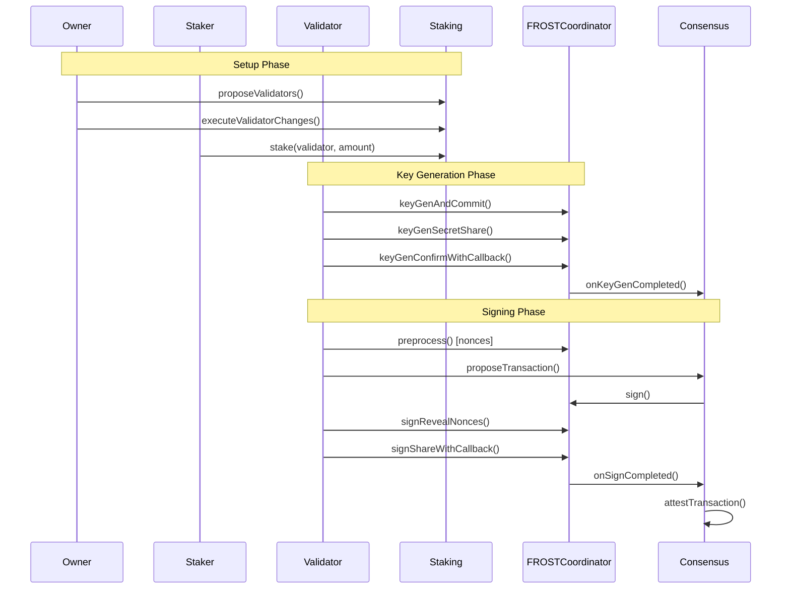

## Introduction

This documentation covers the onchain smart contract infrastructure that powers Safenet.

## Core Contracts

### 1. [Staking Contract](./staking.md)
**Purpose**: Manages validator registration and SAFE token staking.

| Aspect | Description |
|--------|-------------|
| Token | SAFE (ERC-20) |
| Role | Economic security layer |
| Key Feature | Timelocked withdrawals |
| Access Control | Owner-governed with public execution |

**Key Operations**:
- Stake tokens toward validators
- Initiate and claim withdrawals
- Register/deregister validators (owner)

### 2. [FROST Coordinator Contract](./frost-coordinator.md)
**Purpose**: Orchestrates distributed key generation (DKG) and threshold signing ceremonies.

| Aspect | Description |
|--------|-------------|
| Protocol | FROST (RFC-9591) |
| Curve | secp256k1 |
| Role | Cryptographic coordination |
| Key Feature | onchain signature aggregation |

**Key Operations**:
- Distributed Key Generation (DKG)
- Nonce preprocessing
- Signature share collection and aggregation

### 3. [Consensus Contract](./consensus.md)
**Purpose**: Manages validator epochs and transaction attestations.

| Aspect | Description |
|--------|-------------|
| Role | Protocol state machine |
| Key Feature | Epoch-based validator rotation |
| Integration | Calls FROSTCoordinator for signatures |

**Key Operations**:
- Propose and stage new epochs
- Propose transactions for validation
- Record attestations

---

## Contract Interactions

---

## Related Resources

- [RFC-9591: FROST Protocol](https://datatracker.ietf.org/doc/html/rfc9591)
- [FROST Book](https://frost.zfnd.org/frost.html)
- [Safenet](https://github.com/safe-research/shieldnet)
