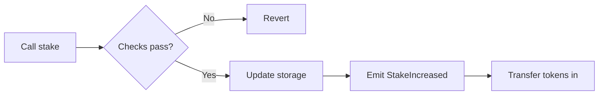
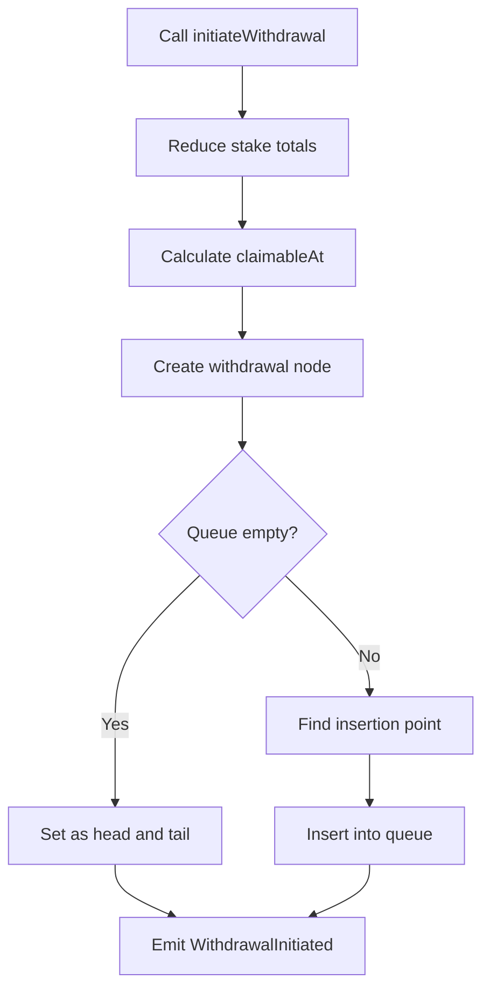
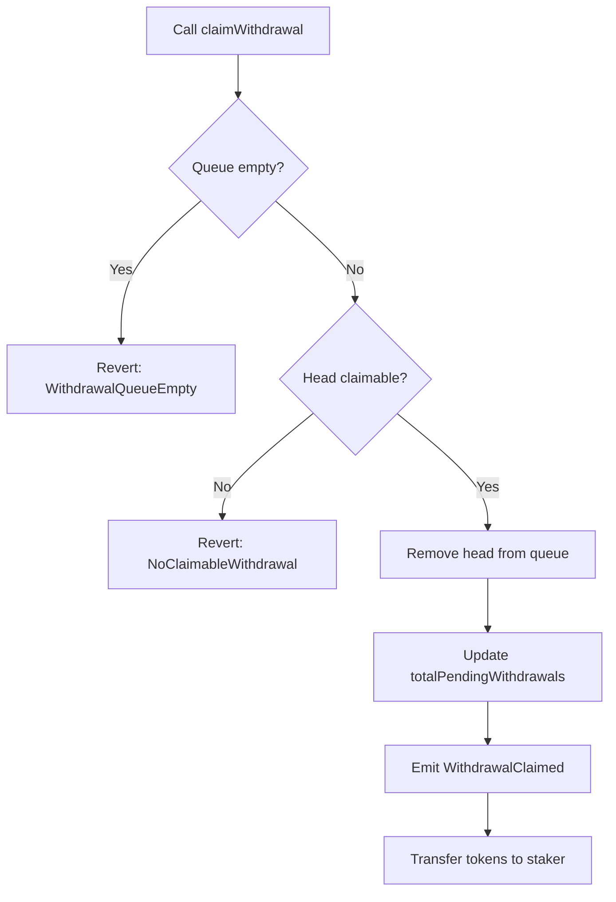
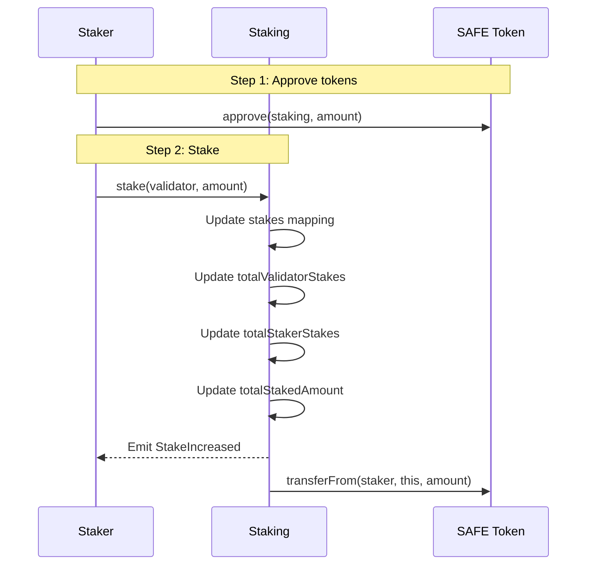
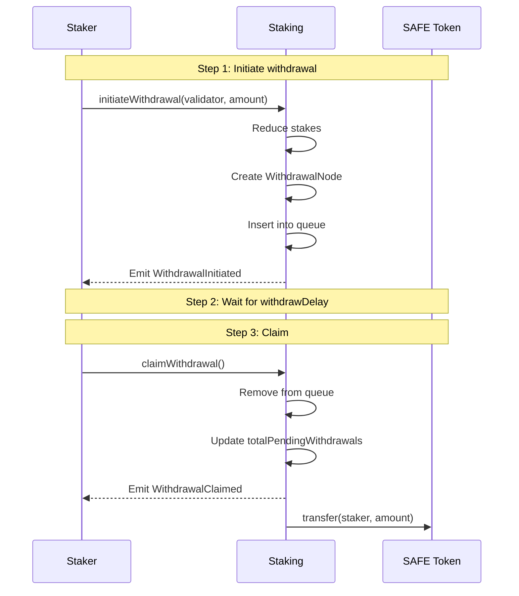
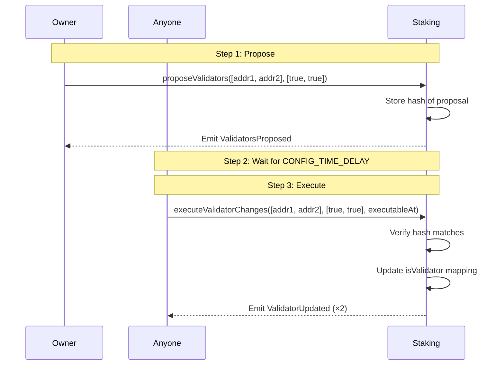

## Overview

The `Staking` contract manages SAFE token deposits tied to validator addresses. It serves as the **economic security layer** for Safenet, ensuring validators have skin in the game.

### Purpose

| Function | Description |
|----------|-------------|
| **Stake Management** | Hold and track SAFE tokens staked toward validators |
| **Validator Registry** | Maintain list of registered validators |
| **Withdrawal Queue** | Manage delayed withdrawals with FIFO processing |
| **Configuration** | Govern protocol parameters with timelocked changes |

### Key Characteristics

- **Non-upgradeable**: Immutable after deployment
- **No Rewards/Slashing**: Pure ledger for deposits (rewards handled elsewhere)
- **Timelocked Config**: All configuration changes require waiting periods

---

## ELI5: What is Staking?

Think of staking like a security deposit:

1. **You want to be a validator** (or support one) → you lock up SAFE tokens
2. **The tokens stay locked** while the validator is active
3. **Want your tokens back?** → Request withdrawal and wait (like a notice period)
4. **After the waiting period** → Claim your tokens

The waiting period exists so that if a validator misbehaves, there's time to respond before they can withdraw their stake.

---

## External Functions

### Staking Operations

#### `stake(address validator, uint256 amount)`

Deposit SAFE tokens toward a validator.

**Requirements**:
- `amount > 0`
- `validator != address(0)`
- `validator` must be registered

**Flow**:


**Example**:
```solidity
// Approve tokens first
safeToken.approve(address(staking), 1000e18);

// Stake toward validator
staking.stake(validatorAddress, 1000e18);
```

---

#### `initiateWithdrawal(address validator, uint256 amount)`

Start a withdrawal with automatic queue insertion.

**Requirements**:
- `amount > 0`
- `stakes[msg.sender][validator] >= amount`

**Flow**:


**Gas Warning**: This function traverses the queue from tail to find the correct insertion point. For users with many pending withdrawals, consider using `initiateWithdrawalAtPosition()` instead.

---

#### `initiateWithdrawalAtPosition(address validator, uint256 amount, uint64 previousId)`

Start a withdrawal with manual queue position (gas optimized).

**Parameters**:
- `previousId`: ID of the node after which to insert (0 = insert at head)

**Requirements**:
- Same as `initiateWithdrawal`
- `previousId` must exist (or be 0)
- Insertion must maintain ascending `claimableAt` order

**When to Use**:
- You have many pending withdrawals
- You know the correct insertion position
- Gas optimization is important

---

#### `claimWithdrawal()`

Claim the first claimable withdrawal from the queue.

**Requirements**:
- Queue is not empty
- `block.timestamp >= head.claimableAt`

**Flow**:


---

### Configuration (Owner Only)

#### `proposeWithdrawDelay(uint128 newDelay)`

Propose a new withdrawal delay.

**Requirements**:
- Caller is owner
- `newDelay > 0`
- `newDelay <= CONFIG_TIME_DELAY`

**Note**: New proposals overwrite pending ones. There's no explicit cancellation.

---

#### `proposeValidators(address[] validators, bool[] isRegistration)`

Propose validator registration/deregistration changes.

**Parameters**:
- `validators`: Array of validator addresses
- `isRegistration`: `true` = register, `false` = deregister

**Requirements**:
- Caller is owner
- Arrays are non-empty and equal length
- No zero addresses or contract address

**Important**: Only a hash is stored. Execution requires providing the exact same arrays.

---

### Configuration Execution (Public)

#### `executeWithdrawDelayChange()`

Execute a pending withdraw delay change after timelock.

**Requirements**:
- Proposal exists (`executableAt != 0`)
- `block.timestamp >= executableAt`

---

#### `executeValidatorChanges(address[] validators, bool[] isRegistration, uint256 executableAt)`

Execute pending validator changes after timelock.

**Requirements**:
- Hash of parameters matches stored `pendingValidatorChangeHash`
- `block.timestamp >= executableAt`

---

### Token Recovery (Owner Only)

#### `recoverTokens(address token, address to)`

Recover accidentally sent tokens.

**Behavior**:
- For `SAFE_TOKEN`: Only recovers excess beyond `totalStakedAmount + totalPendingWithdrawals`
- For other tokens: Recovers full balance

---

### View Functions

#### `getPendingWithdrawals(address staker) → WithdrawalInfo[]`

Get all pending withdrawals for a staker.

**Note**: O(n) traversal - intended for off-chain use.

---

#### `getNextClaimableWithdrawal(address staker) → (uint256 amount, uint256 claimableAt)`

Get the next withdrawal in queue.

---

## Process Flows

### Complete Staking Flow



### Complete Withdrawal Flow



### Validator Registration Flow



---

## Security Considerations

### Access Control

| Function | Access | Rationale |
|----------|--------|-----------|
| `stake`, `initiateWithdrawal*`, `claimWithdrawal` | Public | User operations |
| `proposeValidators`, `proposeWithdrawDelay` | Owner | Sensitive configuration |
| `executeValidatorChanges`, `executeWithdrawDelayChange` | Public | Anyone can execute after timelock |
| `recoverTokens` | Owner | Emergency operation |

### Invariants

1. **Token Conservation**: `SAFE_TOKEN.balanceOf(this) >= totalStakedAmount + totalPendingWithdrawals`
2. **Queue Ordering**: Withdrawals are sorted by `claimableAt` ascending
3. **Delay Bounds**: `0 < withdrawDelay <= CONFIG_TIME_DELAY`
4. **ID Monotonicity**: `nextWithdrawalId` only increases

### Known Risks

| Risk | Mitigation | Notes |
|------|------------|-------|
| **Queue gas griefing** | Use `initiateWithdrawalAtPosition` | Long queues make `initiateWithdrawal` expensive |
| **Proposal overwriting** | Monitor events | New proposals silently replace old ones |
| **Timestamp manipulation** | Uses block.timestamp | Miners can manipulate within consensus bounds |
| **Validator deregistration** | Doesn't block withdrawals | Stakes can still be withdrawn |

### Edge Cases

1. **Staking to pending-deregister validator**: Allowed. The check only verifies current `isValidator` status.
2. **Duplicate validators in proposal**: Allowed but not recommended. Last value wins.
3. **Withdrawal ID overflow**: Theoretical at `2^64-1` withdrawals. Not practically reachable.

---

## Parameters Reference

| Parameter | Type | Constraints | Description |
|-----------|------|-------------|-------------|
| `SAFE_TOKEN` | address | Immutable, non-zero | ERC-20 token for staking |
| `CONFIG_TIME_DELAY` | uint256 | Immutable, non-zero | Timelock for config changes |
| `withdrawDelay` | uint128 | `> 0`, `<= CONFIG_TIME_DELAY` | Withdrawal waiting period |
| `nextWithdrawalId` | uint64 | Starts at 1, monotonic | Unique ID generator |

---

## Integration Examples

### Staking Tokens

```solidity
// 1. Get contract references
IERC20 safeToken = IERC20(SAFE_TOKEN_ADDRESS);
Staking staking = Staking(STAKING_ADDRESS);

// 2. Approve staking contract
safeToken.approve(address(staking), amount);

// 3. Stake toward validator
staking.stake(validatorAddress, amount);
```

### Checking Stake Balance

```solidity
// Individual stake
uint256 myStake = staking.stakes(myAddress, validatorAddress);

// Total stake to validator
uint256 validatorTotal = staking.totalValidatorStakes(validatorAddress);

// My total across all validators
uint256 myTotal = staking.totalStakerStakes(myAddress);
```

### Withdrawing Tokens

```solidity
// 1. Initiate withdrawal
staking.initiateWithdrawal(validatorAddress, amount);

// 2. Check when claimable
(uint256 amt, uint256 claimableAt) = staking.getNextClaimableWithdrawal(myAddress);

// 3. Wait until claimableAt...

// 4. Claim
staking.claimWithdrawal();
```

---
