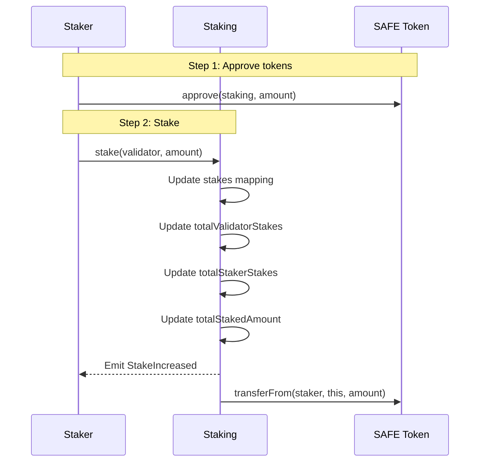
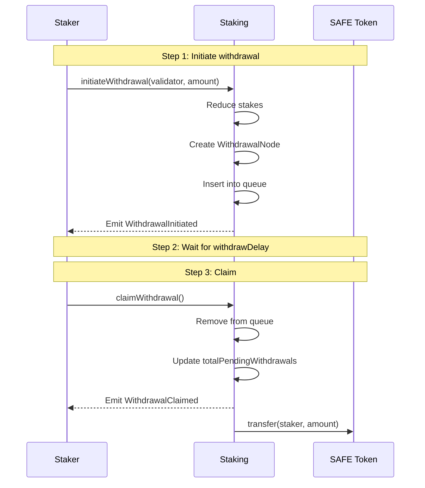
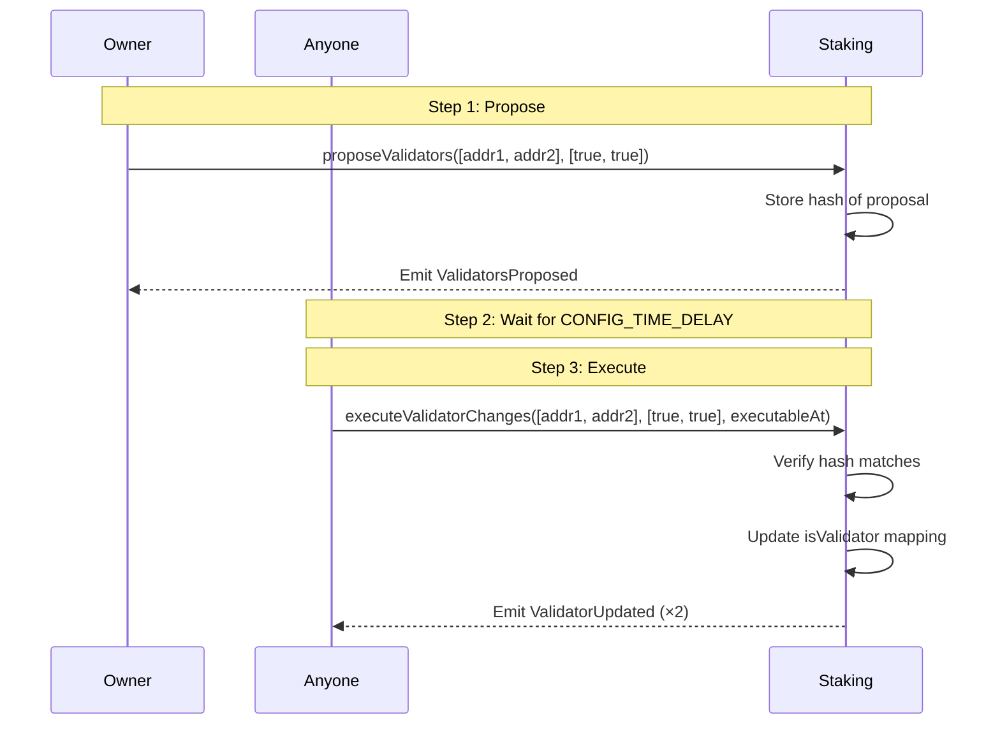

### Purpose

| Function | Description |
|----------|-------------|
| **Stake Management** | Hold and track SAFE tokens staked toward validators |
| **Validator Registry** | Maintain list of registered validators |
| **Withdrawal Queue** | Manage delayed withdrawals with FIFO processing |
| **Configuration** | Govern protocol parameters with timelocked changes |

### Key Characteristics

- **Non-upgradeable**: Immutable after deployment
- **No Rewards/Slashing**: Pure ledger for deposits (rewards handled elsewhere)
- **Timelocked Config**: All configuration changes require waiting periods

---

## ELI5: What is Staking?

Think of staking like a security deposit:

1. **You want to be a validator** (or support one) → you lock up SAFE tokens
2. **The tokens stay locked** while the validator is active
3. **Want your tokens back?** → Request withdrawal and wait (like a notice period)
4. **After the waiting period** → Claim your tokens

The waiting period exists so that if a validator misbehaves, there's time to respond before they can withdraw their stake.

---

## Process Flows

### Staking Flow



### Withdrawal Flow



### Validator Registration Flow



---

## Security Considerations

### Access Control

| Function | Access | Rationale |
|----------|--------|-----------|
| `stake`, `initiateWithdrawal*`, `claimWithdrawal` | Public | User operations |
| `proposeValidators`, `proposeWithdrawDelay` | Owner | Sensitive configuration |
| `executeValidatorChanges`, `executeWithdrawDelayChange` | Public | Anyone can execute after timelock |
| `recoverTokens` | Owner | Emergency operation |

### Invariants

1. **Token Conservation**: `SAFE_TOKEN.balanceOf(this) >= totalStakedAmount + totalPendingWithdrawals`
2. **Queue Ordering**: Withdrawals are sorted by `claimableAt` ascending
3. **Delay Bounds**: `0 < withdrawDelay <= CONFIG_TIME_DELAY`
4. **ID Monotonicity**: `nextWithdrawalId` only increases

### Known Risks

| Risk | Mitigation | Notes |
|------|------------|-------|
| **Queue gas griefing** | Use `initiateWithdrawalAtPosition` | Long queues make `initiateWithdrawal` expensive |
| **Proposal overwriting** | Monitor events | New proposals silently replace old ones |
| **Timestamp manipulation** | Uses block.timestamp | Miners can manipulate within consensus bounds |
| **Validator deregistration** | Doesn't block withdrawals | Stakes can still be withdrawn |

### Edge Cases

1. **Staking to pending-deregister validator**: Allowed. The check only verifies current `isValidator` status.
2. **Duplicate validators in proposal**: Allowed but not recommended. Last value wins.
3. **Withdrawal ID overflow**: Theoretical at `2^64-1` withdrawals. Not practically reachable.

---

## Parameters Reference

| Parameter | Type | Constraints | Description |
|-----------|------|-------------|-------------|
| `SAFE_TOKEN` | address | Immutable, non-zero | ERC-20 token for staking |
| `CONFIG_TIME_DELAY` | uint256 | Immutable, non-zero | Timelock for config changes |
| `withdrawDelay` | uint128 | `> 0`, `<= CONFIG_TIME_DELAY` | Withdrawal waiting period |
| `nextWithdrawalId` | uint64 | Starts at 1, monotonic | Unique ID generator |

---

## Integration Examples

These integration examples are primarily for **off-chain clients and applications** that interact with the Staking contract.

### Staking Tokens

```solidity
// 1. Get contract references
IERC20 safeToken = IERC20(SAFE_TOKEN_ADDRESS);
Staking staking = Staking(STAKING_ADDRESS);

// 2. Approve staking contract
safeToken.approve(address(staking), amount);

// 3. Stake toward validator
staking.stake(validatorAddress, amount);
```

If batch transactions are possible, then approving of tokens and staking can be done as a single transaction.

### Checking Stake Balance

```solidity
// Individual stake
uint256 myStake = staking.stakes(myAddress, validatorAddress);

// Total stake to validator
uint256 validatorTotal = staking.totalValidatorStakes(validatorAddress);

// My total across all validators
uint256 myTotal = staking.totalStakerStakes(myAddress);
```

### Withdrawing Tokens

```solidity
// 1. Initiate withdrawal
staking.initiateWithdrawal(validatorAddress, amount);

// 2. Check when claimable
(uint256 amt, uint256 claimableAt) = staking.getNextClaimableWithdrawal(myAddress);

// 3. Wait until claimableAt...

// 4. Claim
staking.claimWithdrawal();
```

---
