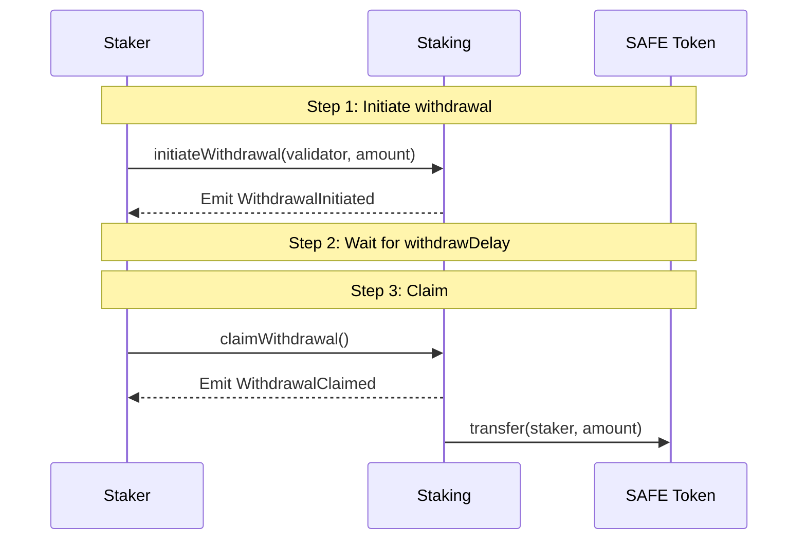

Staked SAFE tokens are not immediately withdrawable. A mandatory **withdrawal delay** applies between initiating an unstake and being able to claim your tokens back.

## Withdrawal flow



### Checking when you can claim

```solidity
// Check when your next withdrawal is claimable
(uint256 amount, uint256 claimableAt) = staking.getNextClaimableWithdrawal(myAddress);

// After claimableAt has passed:
staking.claimWithdrawal();
```

## Parameters

| Parameter | Description |
|-----------|-------------|
| `withdrawDelay` | Mandatory waiting period between initiating and claiming a withdrawal |
| `CONFIG_TIME_DELAY` | Minimum timelock for any changes to protocol configuration, including `withdrawDelay` |

The current `withdrawDelay` value is set at deployment. Any change to it requires a governance proposal and must wait out the `CONFIG_TIME_DELAY` before taking effect.

## Withdrawal queue

Withdrawals are processed in FIFO order per staker. If you have multiple pending withdrawals, they are queued and must be claimed in order.

<Note>
If the withdrawal queue becomes very long, `initiateWithdrawal` can become expensive in gas. Use `initiateWithdrawalAtPosition` to specify your position in the queue and avoid this.
</Note>

TODO: Add current `withdrawDelay` value once contracts are deployed.
