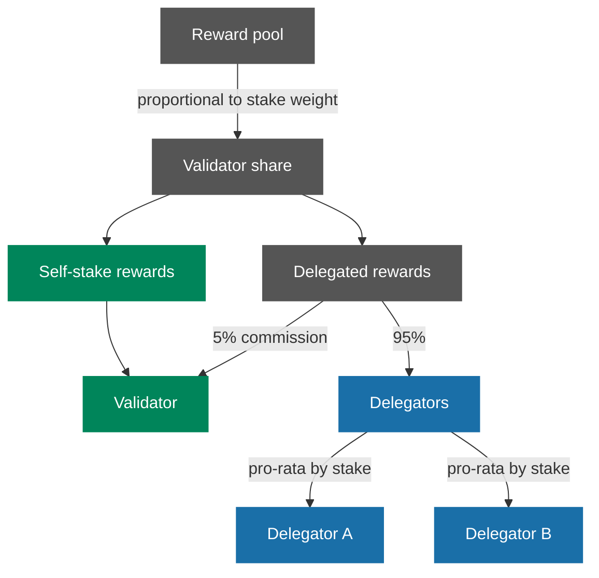

<Note>
The reward mechanism described on this page is a proposal pending SafeDAO approval. Parameters and mechanics may change before launch.
</Note>

Safenet Beta distributes rewards to Validators and Delegators every two weeks (the "reward period") in recognition of their contribution to securing the network. The reward mechanism is stake-weighted and designed with built-in safeguards to discourage centralization and support a balanced, resilient Validator set. The Validator set for a given period includes any Validator active at any point during that period, not only those active at its close.

**Time-weighted stake**

- Rewards are calculated using the **average staked balance over the reward period**, not a single snapshot.
- For both Validators and Delegators, stake is treated as a **time-weighted average** of the balance held during the reward period.

**Stake-weighted rewards with centralization caps**

- Rewards grow **linearly with total stake** up to a threshold **T**.
- Above **T**, rewards grow **sub-linearly** (proportional to √x), reducing incentives for oversized Validators.
- The threshold is defined as the total network stake divided by the number of active Validators.

**Minimum Validator self-stake requirement**

- Validators must maintain a minimum time-weighted average self-stake ($\bar s_i$) of **3,500,000 SAFE** over the reward period.
- Validators below this threshold receive **no Validator rewards** for that period.
- Delegators who delegated to such Validators remain eligible to receive rewards, provided the Validator meets the participation requirement.

**Participation-based eligibility**

- Rewards are conditional on Validator participation.
- Validators with participation below **75%** during the reward period generate **no rewards**.
- If a Validator fails to meet the participation threshold, neither the Validator nor its Delegators receive rewards for that reward period.

**Validator commission**

- Validators charge a **5% commission** on rewards generated by delegated stake.
- **95%** of delegated rewards are distributed to Delegators.
- **5%** is retained by the Validator, in addition to rewards earned on their own stake (if eligible).
- If the Validator's registered Staker address changes during the period, the full period's commission (including any earned before the change) is paid to the address registered at period end.

*How rewards flow from the pool to a single Validator and its Delegators in a reward period.*

*Simplified: omits the stake weight curve, participation filter, and minimum self-stake requirement. These affect the size of each Validator's share but not the flow shown above. See [Calculation](#calculation) for the full mechanics.*

**Minimum payout threshold**

- Rewards are only paid out if the recipient is entitled to at least **1 SAFE token** for the reward period.
- This prevents economically inefficient micro-payouts.
- Any unpaid rewards are carried forward and added to the reward pool of the next reward period.

## Calculation

This section provides the formal definition of the Safenet Beta reward mechanism.
All stake values are time-averaged over the reward period.

**Glossary**

*Sets and participants*

- $V$ – set of Validators active at any point during the reward period
- $N = |V|$ – number of Validators in $V$

*Stake*

- $\bar s_i$ - average SAFE tokens self-staked by Validator $i$ over the reward period
- $\bar d_{j,i}$ - average SAFE tokens delegated by Delegator $j$ to Validator $i$
- $\bar d_i = \sum_j \bar d_{j,i}$ - total average delegated stake to Validator $i$
- $\bar S_i = \bar s_i + \bar d_i$ - total average stake backing Validator $i$
- $\bar S_{\text{total}} = \sum_{i \in V} \bar S_i$ - total average stake in the network

*Participation*

- $p_i \in [0,1]$ - participation rate of Validator $i$ during the reward period
- $p_{\min} = 0.75$ - minimum participation threshold required to earn rewards

*Minimum self-stake requirement*

- $s_{\min} = 3{,}500{,}000$ SAFE - threshold applied to $\bar s_i$, not to the balance at any single point in time

*Rewards*

- $\Delta t$ - duration of the reward period
- $R$ - total reward pool distributed in the reward period
- $R_i$ - reward allocated to Validator $i$ before commission
- $R_i^{\text{self}}$ - portion of $R_i$ attributable to Validator self-stake
- $R_i^{\text{del}}$ - portion of $R_i$ attributable to delegated stake
- $R_i^{\text{Validator}}$ - total reward earned by Validator $i$ before minimum payout filtering
- $R_i^{\text{Delegators}}$ - total reward allocated to Delegators of Validator $i$
- $R_{j,i}$ - reward allocated to Delegator $j$ for delegation to Validator $i$

*Incentive parameters*

- $T$ - stake threshold where linear rewards stop
- $c = 0.05$ - Validator commission rate on delegated rewards
- $m = 1$ - minimum payout threshold (in SAFE tokens)

*Weights*

- $w(\bar S_i)$ - stake-based reward weight for Validator $i$
- $\tilde w_i$ - effective reward weight after participation filtering

*Payouts*

- $P_i$ - raw reward payout allocated to Validator $i$ **before applying the minimum payout rule**
- $P_{j,i}$ - raw reward payout allocated to Delegator $j$ **before applying the minimum payout rule**
- $\hat P_i$ - final reward payout transferred to Validator $i$ **after applying the minimum payout rule**
- $\hat P_{j,i}$ - final reward payout transferred to Delegator $j$ **after applying the minimum payout rule**
- $R_{\text{paid}}$ - total rewards paid out in the reward period
- $R_{\text{unpaid}}$ - rewards not paid out and carried forward

**Time-averaged stake**

For any stake balance $x(t)$ over the reward period $[t_0, t_1]$ with $\Delta t = t_1 - t_0$, the time-average is defined as:

$$
\bar x = \frac{1}{\Delta t} \int_{t_0}^{t_1} x(t)\, dt
$$

Here $t$ represents Unix time (seconds). Averages are not block-weighted.

**Stake threshold**

The linear reward threshold is defined as the average stake per Validator:

$$
T = \frac{\bar S_{\text{total}}}{N}
$$

**Stake weighting function**

Rewards grow linearly up to $T$ and sub-linearly beyond $T$:

$$
w(\bar S_i) =
\begin{cases}
\bar S_i, & \text{if } \bar S_i \le T \\
\sqrt{\bar S_i \cdot T}, & \text{if } \bar S_i > T
\end{cases}
$$

This penalizes oversized Validators and incentivizes delegation toward smaller Validators.

The curve is linear from zero up to the threshold $T$ (the average stake per Validator in the network). Above $T$, additional stake continues to earn rewards but at a diminishing rate.

In practice: delegating to a Validator already above $T$ earns less marginal reward than delegating to one below it.

*Reward weight as a function of total stake. Below $T$, each additional SAFE earns the same marginal reward. Above $T$, marginal reward decreases smoothly. $T$ is recalculated each reward period as total network stake divided by the number of active Validators.*

**Participation filter**

Validators must satisfy the minimum participation requirement in order for **any rewards (Validator or Delegator)** to be generated for that Validator:

$$
\tilde w_i =
\begin{cases}
p_i \cdot w(\bar S_i),
& \text{if } p_i \ge p_{\min} \\
0,
& \text{if } p_i < p_{\min}
\end{cases}
$$

If $p_i < p_{\min}$, no rewards are generated for Validator $i$ or its Delegators during that reward period.

The minimum self-stake requirement affects Validator earnings only: if $\bar s_i < s_{\min}$ and $p_i \ge p_{\min}$, the Validator forfeits its Validator reward share, while Delegator rewards remain unaffected.

**Reward allocation across Validators**

$$
W = \sum_{k \in V} \tilde w_k
$$

Validator $i$'s reward allocation:

$$
R_i = R \cdot \frac{\tilde w_i}{W}
$$

**Split between Validator and Delegators**

*Attribution by stake source*

Reward attributable to Validator self-stake:

$$
R_i^{\text{self}} = R_i \cdot \frac{\bar s_i}{\bar S_i}
$$

Reward attributable to delegated stake:

$$
R_i^{\text{del}} = R_i \cdot \frac{\bar d_i}{\bar S_i}
$$

*Commission split*

If $\bar s_i \ge s_{\min}$:

$$
R_i^{\text{Validator}} = R_i^{\text{self}} + c \cdot R_i^{\text{del}}
$$

If $\bar s_i < s_{\min}$:

$$
R_i^{\text{Validator}} = 0
$$

Delegator earnings:

$$
R_i^{\text{Delegators}} =
\begin{cases}
(1 - c) \cdot R_i^{\text{del}}, & \text{if } \bar s_i \ge s_{\min} \\
R_i^{\text{del}}, & \text{if } \bar s_i < s_{\min}
\end{cases}
$$

Validator commission and self-stake rewards are paid to the Validator's registered Staker address as recorded at the end of the reward period. If the Staker address changes during the period, the full period's Validator rewards (including commission accrued before the change) are paid to the address registered at period end.

**Per-Delegator reward**

$$
R_{j,i} = R_i^{\text{Delegators}} \cdot \frac{\bar d_{j,i}}{\bar d_i}
$$

**Minimum payout rule**

Raw payouts:

$$
P_i = R_i^{\text{Validator}}
$$

$$
P_{j,i} = R_{j,i}
$$

Final payouts:

$$
\hat P_i =
\begin{cases}
P_i, & \text{if } P_i \ge m \\
0, & \text{if } P_i < m
\end{cases}
$$

$$
\hat P_{j,i} =
\begin{cases}
P_{j,i}, & \text{if } P_{j,i} \ge m \\
0, & \text{if } P_{j,i} < m
\end{cases}
$$

Total rewards paid out:

$$
R_{\text{paid}} =
\sum_{i \in V} \hat P_i
+
\sum_{i \in V} \sum_j \hat P_{j,i}
$$

Unpaid rewards:

$$
R_{\text{unpaid}} = R - R_{\text{paid}}
$$

Unpaid rewards remain in the reward pool and are carried forward to the next reward period.

## Distribution

Rewards are calculated offchain and distributed onchain via a Merkle distributor contract.

Once allocated, rewards do not expire. Recipients must actively claim their rewards either:

- Directly from the Merkle distributor contract, or
- Through the dedicated staking / claiming interface.

**Resources**

- Rewards calculation & distribution: [safe-fndn/safenet-staking-scripts](https://github.com/safe-fndn/safenet-staking-scripts)
- If approved, rewards can be claimed via one of the [available staking interfaces](http://safefoundation.org/safenet).

## Compliance

As rewards are funded by assets held on the books of the Safe Ecosystem Foundation (SEF), KYC and AML requirements apply.

- Addresses sanctioned by OFAC, as identified through [Chainalysis' on-chain oracle](https://go.chainalysis.com/chainalysis-oracle-docs.html), are excluded from receiving rewards.
- Addresses receiving rewards exceeding the equivalent of USD 1,000 within a two-week payout period are required to complete a KYC process prior to distribution.

For KYC inquiries or to initiate the verification process, please contact
[legal@safefoundation.org](mailto:legal@safefoundation.org).
