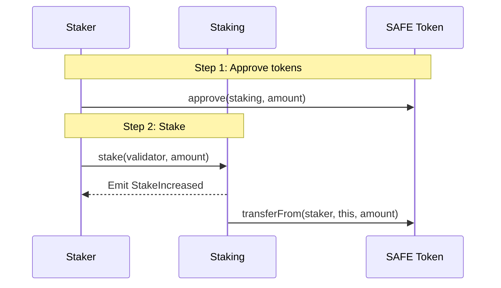

The [Staking contract](https://github.com/safe-research/shieldnet/blob/main/contracts/src/Staking.sol) manages SAFE token deposits tied to validator addresses. It serves as the **economic security layer** for Safenet, ensuring validators have skin in the game.

### Purpose

| Function | Description |
|----------|-------------|
| **Stake Management** | Hold and track SAFE tokens staked toward validators |
| **Validator Registry** | Maintain list of registered validators |
| **Withdrawal Queue** | Manage delayed withdrawals with FIFO processing |
| **Configuration** | Govern protocol parameters with timelocked changes |

### Key Characteristics

- **Non-upgradeable**: Immutable after deployment
- **No Rewards/Slashing in Beta**: Pure ledger for deposits (rewards handled separately)
- **Timelocked Config**: All configuration changes require waiting periods

## How staking works

Think of staking like a security deposit:

1. **You want to support a validator** → you lock up SAFE tokens toward their address
2. **The tokens stay locked** while the validator is active
3. **Want your tokens back?** → Request a withdrawal and wait out the delay period
4. **After the waiting period** → Claim your tokens

The waiting period exists so that if a validator misbehaves, there's time to respond before they can withdraw their stake.

## Staking Flow



### Staking Tokens

```solidity
// 1. Get contract references
IERC20 safeToken = IERC20(SAFE_TOKEN_ADDRESS);
Staking staking = Staking(STAKING_ADDRESS);

// 2. Approve staking contract
safeToken.approve(address(staking), amount);

// 3. Stake toward validator
staking.stake(validatorAddress, amount);
```

If batch transactions are possible, approving tokens and staking can be done as a single transaction.

### Checking Stake Balance

```solidity
// Individual stake
uint256 myStake = staking.stakes(myAddress, validatorAddress);

// Total stake to validator
uint256 validatorTotal = staking.totalValidatorStakes(validatorAddress);

// My total across all validators
uint256 myTotal = staking.totalStakerStakes(myAddress);
```

## Minimum validator self-stake

Validators must maintain a minimum average self-stake of **3,500,000 SAFE** during each reward period to be eligible for validator rewards.

→ See: [Staking rewards](/safenet/staking/rewards) for how this affects reward eligibility.
